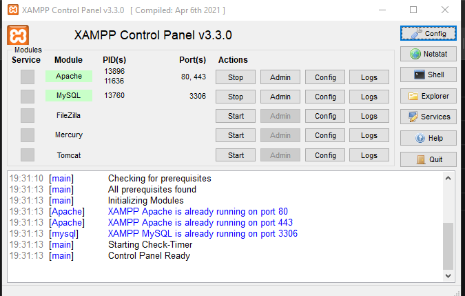
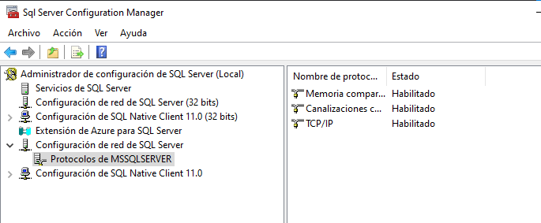
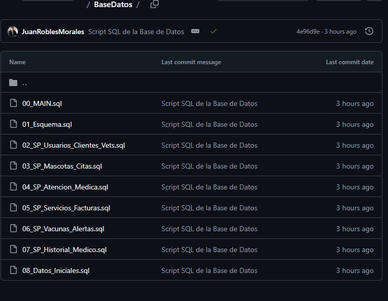
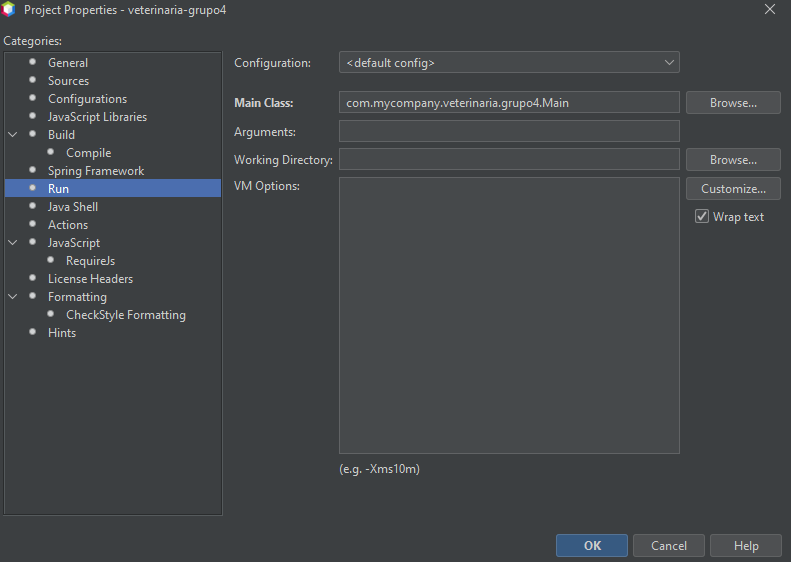

## 1. Instalar XAAMP(si no esta instalado si desea usar el mysql workbench)

Iniciar los modulos importantes:



## Instalar Maven (si no esta instalado)

---


### 2.1 Verificar si Maven ya esta instalado

**bash**

```
mvn -v
```

Si muestra la version, puede saltar al paso 3.

### 2.2 Descargar Maven

Ir a: [https://maven.apache.org/download.cgi](https://maven.apache.org/download.cgi)

Descargar: **Binary zip archive** (ejemplo: apache-maven-3.9.x-bin.zip)

### 2.3 Extraer Maven

Extraer en una ruta simple, por ejemplo:

```
C:\maven
```

Debe quedar asi:

```
C:\maven\apache-maven-3.9.x\
```

### 2.4 Configurar variables de entorno

Abrir: Buscar en Windows -> "Variables de entorno"

#### Crear variable MAVEN_HOME

| Campo  | Valor                       |
| ------ | --------------------------- |
| Nombre | MAVEN_HOME                  |
| Valor  | C:\maven\apache-maven-3.9.x |

#### Editar variable PATH

Agregar esta ruta:

```
C:\maven\apache-maven-3.9.x\bin
```

### 2.5 Reiniciar terminal

Cerrar CMD o PowerShell y abrir uno nuevo

### 2.6 Verificar instalacion

**bash**

```
mvn -v
```

Debe mostrar algo como:

```
Apache Maven 3.9.x
Java version: 17
```

---

## 3. Configurar la Base de Datos

### Opcion A: Usar SQL Server

#### 3A.1 Ejecutar script principal

Ejecutar el archivo `00_MAIN.sql` para preparar la base de datos en SQL Server:

[https://image/instalacion/1775881260894.png](https://image/instalacion/1775881260894.png)

#### 3A.2 Verificar configuracion de SQL Server

Abrir  **SQL Server Configuration Manager** :

* Ir a: SQL Server Network Configuration -> Protocols for MSSQLSERVER
* Habilitar **TCP/IP** (Enabled = Yes)

#### 3A.3 Configurar puerto

Ir a: TCP/IP -> IP Addresses -> IPAll

| Campo             | Valor         |
| ----------------- | ------------- |
| TCP Dynamic Ports | (dejar vacio) |
| TCP Port          | 1433          |

[https://image/instalacion/1775876064255.png](https://image/instalacion/1775876064255.png)

#### 3A.4 Reiniciar servicio SQL Server

* Ir a: SQL Server Services
* Seleccionar: SQL Server (MSSQLSERVER)
* Hacer clic derecho -> Restart

#### 3A.5 Probar conexion SQL Server

**bash**

```
sqlcmd -S TU_SERVIDOR_SQL_SERVER,1433 -E -C
```

Si funciona debe aparecer:

```
1>
```

### Opcion B: Usar MySQL Workbench

#### 3B.1 Ejecutar script MySQL

Ejecutar el codigo ubicado en:

```
BaseDatos/CODIGO_PARA_MYSQL/codigo_completo.sql
```

en su MySQL Workbench.

---

## 4. Configurar la Conexion a Base de Datos

### 4.1 Ubicar archivo de configuracion

El archivo se encuentra en:

```
src/main/resources/database.properties
```

### 4.2 Seleccionar el tipo de base de datos

Editar la propiedad `db.type`:

**properties**

```
# Para usar MySQL
db.type=mysql

# Para usar SQL Server
db.type=sqlserver
```

### 4.3 Verificar credenciales

Asegurar que las siguientes propiedades tengan los valores correctos:

**properties**

```
# Credenciales generales
db.username=veterinaria_user
db.password=123456

# Configuracion para SQL Server (si se usa)
sqlserver.server=localhost
sqlserver.port=1433
sqlserver.database=db_veterinaria

# Configuracion para MySQL (si se usa)
mysql.host=localhost
mysql.port=3306
mysql.database=db_veterinaria
```

---

## 5. Descargar Dependencias del Proyecto

En la carpeta del proyecto ejecutar:

**bash**

```
mvn clean install
```

Este comando descargara todas las dependencias necesarias, incluyendo:

* Spring Boot Web
* Driver de SQL Server (mssql-jdbc)
* Driver de MySQL (mysql-connector-j)
* FlatLaf (tema visual)
* Swing Pack (componentes adicionales)

---

## 6. Ejecutar el Proyecto

### Opcion A: Ejecutar con Maven

**bash**

```
mvn spring-boot:run
```

### Opcion B: Ejecutar en NetBeans IDE 26

1. Abrir el proyecto en NetBeans
2. Asegurar la siguiente configuracion:

[https://image/instalacion/1775880575906.png](https://image/instalacion/1775880575906.png)

3. Hacer clic en el boton verde (Run Project)

### Opcion C: Ejecutar desde la carpeta raiz

**bash**

```
D:\Users\Usuario\Documents\octavo semestre\VERIFICACION Y VALIDACION DE SOFTWARE\UNIDAD 1\PROYECTO PRIMER PARCIAL\proyecto\veterinaria-grupo-4\veterinaria-grupo4> mvn spring-boot:run
```

---

## 7. Verificar Ejecucion

### 7.1 URL de acceso

Abrir el navegador y acceder a:

```
http://localhost:8080
```

### 7.2 Probar un endpoint

Ejemplo:

```
POST http://localhost:8080/cliente/login
```

### 7.3 Verificar salida en consola

Si todo sale bien, en su motor de base de datos se mostrara:

| Tipo de Objeto | Cantidad |
| -------------- | -------- |
| PROCEDURE      | 105      |
| TABLE          | 21       |
| TRIGGER        | 3        |

En la consola del proyecto aparecera:

```
========================================
Configuracion de Base de Datos cargada:
  Tipo: MYSQL (o SQLSERVER)
  URL: jdbc:... 
  Usuario: veterinaria_user
========================================
Conexion establecida con MYSQL (o SQLSERVER)
```

---

## 8. Solucion de Problemas

### Error: "Driver no encontrado"

**Causa:** Faltan las dependencias en el pom.xml

**Solucion:** Ejecutar `mvn clean install` para descargar los drivers

### Error: "No se encontro el archivo database.properties"

**Causa:** El archivo de configuracion no existe en el classpath

**Solucion:** Verificar que el archivo existe en `src/main/resources/`

### Error: "La propiedad 'db.type' es obligatoria"

**Causa:** Falta la configuracion en database.properties

**Solucion:** Agregar `db.type=mysql` o `db.type=sqlserver` al archivo

### Error de conexion a SQL Server

1. Verificar que TCP/IP esta habilitado
2. Verificar que el puerto 1433 esta configurado
3. Reiniciar el servicio SQL Server
4. Probar conexion con `sqlcmd`

## Configuración de puerto(solo si es necesario)

Ir a:

TCP/IP → IP Addresses → IPAll

Configurar:

TCP Dynamic Ports = (vacío)

TCP Port = 1433



## Reiniciar servicio SQL Server

SQL Server Services

→ SQL Server (MSSQLSERVER)

→ Restart

---

## Probar conexión SQL Server por consola

sqlcmd -S TU_SERVIDOR_SQL_SERVER,1433 -E -C

Si funciona debe aparecer:

1>

### Error de conexion a MySQL

1. Verificar que el servicio MySQL esta corriendo
2. Verificar que el puerto 3306 esta abierto
3. Verificar credenciales de usuario

---

## 9. Estructura del Proyecto

```
veterinaria-grupo4/
├── src/
│   ├── main/
│   │   ├── java/
│   │   │   └── com/mycompany/veterinaria/grupo4/
│   │   │       ├── api/          # Controladores REST
│   │   │       ├── controller/   # Controladores de vista
│   │   │       ├── model/        # Entidades y DAOs
│   │   │       ├── service/      # Servicios de negocio
│   │   │       ├── util/         # Utilidades (DatabaseConnection)
│   │   │       └── view/         # Interfaces graficas (Swing)
│   │   └── resources/
│   │       ├── database.properties   # Configuracion de BD
│   │       ├── application.properties # Configuracion Spring
│   │       └── icon/              # Iconos de la aplicacion
│   └── test/                      # Pruebas unitarias
├── BaseDatos/
│   ├── CODIGO_PARA_MYSQL/
│   │   └── codigo_completo.sql    # Script para MySQL
│   └── 00_MAIN.sql                # Script para SQL Server
├── pom.xml                        # Dependencias Maven
└── README.md                      # Este archivo
```

---

## 10. Tecnologias Utilizadas

| Tecnologia  | Version | Uso                      |
| ----------- | ------- | ------------------------ |
| Java        | 17      | Lenguaje principal       |
| Spring Boot | 3.1.5   | Framework backend        |
| Maven       | 3.9.x   | Gestion de dependencias  |
| SQL Server  | 2019+   | Base de datos (opcional) |
| MySQL       | 8.0+    | Base de datos (opcional) |
| FlatLaf     | 3.5.4   | Tema visual para Swing   |
| Swing       | -       | Interfaz grafica         |
| JUnit       | 5       | Pruebas unitarias        |

---

## 11. Scripts de Base de Datos

### Para SQL Server

Ejecutar en orden:

1. `00_MAIN.sql` - Crea toda la estructura de la base de datos



### Para MySQL

Ejecutar el archivo completo:

```
BaseDatos/CODIGO_PARA_MYSQL/codigo_completo.sql
```


## 12. Ejecutar en NetBeans IDE 26

Usar botón verde (Run Project)

El proyecto debe ser ejecutado como proyecto Maven/Spring BooT como “Run File”, ejecutar directamente con el botón verde, procure tener la siguiente configuración



## 14.1. Comando final de ejecución manual en windows (Opcional) usar la carpeta raíz

D:\Users\Usuario\Documents\octavo semestre\VERIFICACION Y VALIDACION DE SOFTWARE\UNIDAD 1\PROYECTO PRIMER PARCIAL\proyecto\veterinaria-grupo-4\veterinaria-grupo4> mvn spring-boot:run

Si todo sale bien saldrá en su resultados de su motor de base de datos(mysql o sqlserver):

PROCEDURE: 105

TABLE: 21

TRIGGER: 3 y datos iniciales insertados correctamente.
